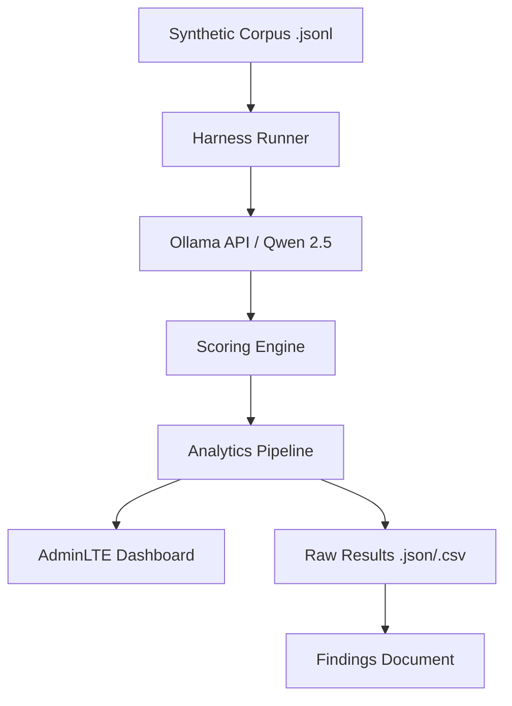

# DebtCollect Eval: Cross-Linguistic Tool-Call Reliability Harness

## 1. Problem
**What problem is being solved?**
In automated debt-collection voice agents, the **tool call is the primary business outcome**. Whether the agent successfully captures a "Promise to Pay" (PTP) or correctly marks a "Dispute" determines the revenue recovery and regulatory compliance of the operation. While LLMs exhibit high performance in English, there is an unquantified reliability gap when borrowers communicate in **Hinglish** (Hindi-English mix) or **Marathi**.

**Why it matters?**
A failure to trigger the correct tool in an Indic language doesn't just result in a poor user experience—it results in lost revenue, incorrect account status, and potential legal non-compliance in highly regulated financial environments.

**Specific Research Question:**
*"How does the tool-calling reliability of locally hosted open-weight models vary between English and Indic languages (Hinglish and Marathi) when processing synthetic collections data, and what is the primary driver of accuracy degradation?"*

---

## 2. Approach
To ensure methodological rigor and eliminate "prompt-tuning" bias, the project followed a strict experimental design.

**Dataset & Preparation**
- **Corpus**: A synthetic test suite of 200+ utterances was constructed.
- **Preparation**: Cases were specifically designed to avoid "schema-perfect" templates. Instead, they mimic real-world borrower behavior, incorporating:
  - **Code-switching**: Natural mixing of English and Indic languages (Hinglish).
  - **Linguistic Nuance**: Relative date markers (e.g., *"kal"*, *"parso"*) and regional currency shorthand.
  - **Conversational Noise**: Hesitant speech, fillers, and non-linear intent.

**Experimental Setup**
- **Models Evaluated**: Qwen 2.5 (4B, 7B, and 9B variants).
- **Baseline**: A single, frozen system prompt was used across all models and languages. This ensures the results measure raw model capability rather than the efficiency of prompt engineering.
- **Determinism**: The `temperature` was forced to `0.0` for all inferences to ensure results are fully reproducible.

**Evaluation Methodology**
- **Execution**: A custom Python harness reads the JSONL suite, sends requests to the local Ollama API, and captures the raw output.
- **Scoring**: A programmatic scoring engine compares the emitted tool name and arguments against a ground-truth "Expected" field in the dataset.
- **Leakage Prevention**: 
  - **Immutable Schemas**: Tool definitions are externalized in `schemas/tools.json` and frozen before the start of the experiment.
  - **Zero-Shot Baseline**: No few-shot examples from the test set were included in the prompts, preventing the model from "memorizing" patterns.

**Metrics**
Performance is quantified using a specific Error Taxonomy:
1. **Correct-tool rate**: Ratio of correct tool names to expected calls.
2. **Malformed-argument rate**: Correct tool, but missing/wrong-typed arguments or enum violations.
3. **Argument-level accuracy**: Exact match of both tool and all argument values.
4. **Spurious-call rate**: Tool triggered when no intent was present (False Positive).
5. **Missed-call rate**: No tool triggered when intent was present (False Negative).
6. **Ambiguous-case handling**: Pass rate for utterances where intent is genuinely unclear.

---

**Tech Stack**
- **Environment**:
  - **OS**: Windows 11 Home Single Language
  - **Python**: 3.14.6
  - **Libraries**: `requests`, `pandas`, `pytest`
- **Model Details**:
  - **Model**: Qwen 2.5
  - **Model Versions**: 4B, 7B, 9B
  - **Provider**: Alibaba Cloud (via Ollama)
  - **Quantization**: 4-bit (Q4_K_M)
  - **Inference Framework**: Ollama
  - **Context Length**: 32k (default)
- **Hardware**:
  - **CPU**: AMD Ryzen 5 4600H
  - **GPU**: NVIDIA GeForce GTX 1650 Ti
  - **VRAM**: 4 GB
  - **RAM**: 16 GB (est.)
  - **CUDA**: Local Ollama runtime (CUDA enabled)
- **UI Framework**: AdminLTE 3 (HTML/JS), Chart.js, DataTables

---

## 4. Architecture / Design



**Component Explanations:**
- **Synthetic Corpus**: The ground-truth dataset containing utterances and expected tool calls.
- **Harness Runner**: Manages the loop of sending prompts and receiving model responses.
- **Ollama API**: Provides the local inference interface for the Qwen models.
- **Scoring Engine**: Applies the error taxonomy to categorize the difference between the actual and expected tool calls.
- **Analytics Pipeline**: Aggregates case-level results into linguistic deltas and accuracy percentages.
- **AdminLTE Dashboard**: A visual interface for auditing individual failures and viewing aggregate metrics.

---

## 5. Key Features
- **Local Model Inference**: Fully air-gapped execution via Ollama for data privacy.
- **Automated Evaluation**: End-to-end pipeline from raw JSONL input to accuracy reports.
- **Cross-Linguistic Delta**: Direct comparison of accuracy between English, Hinglish, and Marathi.
- **Error Taxonomy**: Automated classification of failures (Wrong Tool vs. Malformed Arg vs. Spurious Call).
- **Enterprise Dashboard**: Visual auditing of results using AdminLTE 3.
- **Reproducible Runner**: Configuration-driven execution with fixed temperature and prompt.
- **Raw Export**: Generation of CSV/JSON results for external audit.

---

## 6. Challenges

| Challenge | Solution |
| :--- | :--- |
| **Indic Linguistic Nuance** | Hand-verified the synthetic corpus to ensure relative dates (*"kal"*) and regional markers were accurately mapped to ground truth. |
| **API Stability** | Implemented robust request handling and timeouts to manage high-context system prompt processing in Ollama. |
| **Suite Realism** | Avoided "template-style" data by introducing conversational noise and hesitant speech patterns to prevent model pattern-matching. |
| **Quantization Noise** | Standardized on Q4_K_M quantization across all model sizes to ensure a fair comparison. |

---

## 7. Reproduction Instructions

To reproduce the results of this experiment, follow these steps:

1. **Clone the Repository**:
   ```bash
   git clone <your-repository-url>
   cd <repository-folder>
   ```

2. **Install Dependencies**:
   ```bash
   python -m venv .venv
   # Windows
   .venv\Scripts\activate
   pip install -r requirements.txt
   ```

3. **Setup Model**:
   Ensure [Ollama](https://ollama.com) is installed and running. Pull the target model:
   ```bash
   ollama pull qwen2.5:7b
   ```

4. **Run Evaluation**:
   ```bash
   python scripts/run.py
   ```

5. **Analyze Results**:
   ```bash
   python scripts/evaluate.py
   ```

**Expected Outputs**:
- `results/raw_results.json`: Per-sample inference and scoring data.
- `results/raw_results.csv`: Tabular version of raw results.
- `results/metrics.json`: Aggregated accuracy and error rates per language.

---

## 8. Future Improvements
...
- **Real-world Voice Integration**: Replace JSONL text with a real `Audio -> STT -> Tool-Call` pipeline to measure cascading error rates.
- **Adversarial Red-Teaming**: Use a second agent to generate edge cases specifically designed to trick the model into ignoring dispute signals.
- **Dynamic Prompting**: Investigate if "Few-Shot" prompting for Indic languages can close the accuracy gap without introducing leakage.
- **Expand Model Set**: Evaluate Llama 3.1 and Mistral for cross-linguistic comparison.

---

## 9. AI Usage Disclosure
**AI tools used**: GitHub Copilot was used as a coding and documentation assistant. It assisted with the initial repository scaffolding, the implementation of the AdminLTE dashboard layout, and the generation of the synthetic test corpus. All synthetic data was subsequently hand-verified for realism. The experimental design, model selection, evaluation methodology, interpretation of results, and final conclusions were reviewed and controlled by the author.
